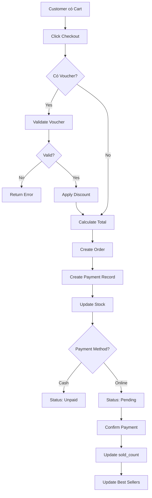

# 🎯 Business Logic Design - PBL6 Pharmacy System

## Tổng quan hệ thống

Hệ thống được thiết kế theo yêu cầu nghiệp vụ như sau:

### 1. 🔐 Authentication & Authorization

#### **Admin & Staff** (Đăng nhập bằng username/password)

```
Flow: Username + Password → Validate → Generate JWT Token
```

**Endpoints:**

- `POST /api/auth/login` - Login với username/password
- `POST /api/auth/register` - Register account mới (Admin only)

**Roles:**

- `Admin` (role_id = 1): Full access
- `Staff` (role_id = 2): Limited access based on permissions
- `Customer` (role_id = 3): Customer access only

---

#### **Customer** (Đăng nhập bằng OTP)

```
Flow: Phone Number → Request OTP → Receive SMS → Verify OTP → Auto Create Account (if new) → Generate JWT Token
```

**Endpoints:**

1. `POST /api/auth/otp/request` - Gửi OTP đến số điện thoại
2. `POST /api/auth/otp/verify` - Xác thực OTP
3. `POST /api/auth/customer/login` - Login với phone + OTP

**Logic:**

```javascript
if (customer_phone_not_exists) {
  // Tạo user account tự động
  create_user(phone, (role_id = 3));
  create_customer(user_id);
}
return jwt_token;
```

**Security:**

- OTP hết hạn sau 5 phút
- Tối đa 5 lần nhập sai
- Chỉ request OTP mới sau 1 phút
- OTP tự động cleanup mỗi 5 phút

---

### 2. 🛒 Shopping Cart System

#### **Auto Cart Creation**

Cart được tạo tự động khi customer thêm sản phẩm đầu tiên:

```javascript
function addToCart(customerId, productId, quantity) {
  // Tìm cart hiện tại
  cart = findCart(customerId, (status = "cart"));

  if (!cart) {
    // Tạo cart mới tự động
    cart = createCart(customerId);
  }

  // Thêm sản phẩm vào cart
  addItem(cart, productId, quantity);

  return cart;
}
```

**Database Design:**

```sql
-- Mỗi customer chỉ có 1 cart active
CONSTRAINT unique_customer_cart UNIQUE (customer_id, status)
WHERE status = 'cart'
```

**Endpoints:**

- `GET /api/cart/:customerId` - Xem giỏ hàng
- `POST /api/cart/:customerId/add` - Thêm sản phẩm (tự động tạo cart nếu chưa có)
- `DELETE /api/cart/:customerId/remove/:productId` - Xóa sản phẩm

---

### 3. 💳 Checkout & Payment System

#### **Checkout Flow với Voucher**



#### **Voucher Validation**

```javascript
function validateVoucher(voucherCode, totalAmount, customerId) {
  voucher = findVoucher(voucherCode);

  // 1. Check existence
  if (!voucher) return error("Voucher không tồn tại");

  // 2. Check date range
  if (now < voucher.start_date || now > voucher.end_date)
    return error("Voucher hết hạn");

  // 3. Check usage limit
  if (voucher.used_count >= voucher.usage_limit)
    return error("Voucher hết lượt sử dụng");

  // 4. Check minimum order value
  if (totalAmount < voucher.min_order_value)
    return error("Đơn hàng chưa đủ giá trị tối thiểu");

  // 5. Check if customer used before
  if (customerUsedVoucher(customerId, voucher.id))
    return error("Bạn đã dùng voucher này rồi");

  // Calculate discount
  if (voucher.discount_type == "percentage") {
    discount = (totalAmount * voucher.discount_value) / 100;
  } else {
    discount = voucher.discount_value;
  }

  return { valid: true, discount };
}
```

#### **Payment Methods**

| Method        | payment_status Initial | Confirm Required |
| ------------- | ---------------------- | ---------------- |
| Cash          | `unpaid`               | No (COD)         |
| Bank Transfer | `pending`              | Yes              |
| Credit Card   | `pending`              | Yes              |
| MoMo          | `pending`              | Yes              |
| ZaloPay       | `pending`              | Yes              |

#### **Endpoints:**

- `POST /api/cart/checkout` - Thanh toán giỏ hàng
- `POST /api/orders/:id/confirm-payment` - Xác nhận thanh toán online
- `POST /api/orders/:id/cancel` - Hủy đơn hàng

---

### 4. ⭐ Best Sellers (Top 10 Sản phẩm bán chạy)

#### **Real-time Tracking**

```javascript
// Sau khi confirm payment
function confirmPayment(orderId) {
  order = getOrder(orderId);

  // Update payment status
  updatePayment(orderId, (status = "paid"));

  // Update order status
  updateOrder(orderId, (payment_status = "paid"), (status = "confirmed"));

  // Update sold count for each product
  for (item in order.items) {
    product = getProduct(item.product_id);
    product.sold_count += item.quantity;

    // Check if should update best sellers
    if (product.sold_count > tenthBestSeller.sold_count) {
      updateBestSellersCache();
    }
  }
}
```

#### **Caching Strategy**

```javascript
function getBestSellers() {
  cache = getBestSellersCache()

  // Return cache if fresh (< 1 hour old)
  if (cache && cache.updated_at > now - 1_hour) {
    return cache
  }

  // Otherwise, query database
  products = getTop10Products() // ORDER BY sold_count DESC LIMIT 10

  // Update cache
  updateCache(products)

  return products
}
```

#### **Auto Update Logic**

1. **Hourly Cron Job** (mỗi giờ)

```javascript
cron.schedule("0 * * * *", () => {
  updateBestSellersCache();
});
```

2. **On Payment Confirmation** (real-time)

```javascript
if (new_sold_count > rank_10_sold_count) {
  updateBestSellersCache(); // Immediate update
}
```

3. **Manual Trigger** (Admin)

```
POST /api/products/best-sellers/update-cache
```

#### **Endpoints:**

- `GET /api/products/best-sellers` - Lấy top 10 (cache)
- `GET /api/products/:id/stats` - Thống kê sản phẩm
- `POST /api/products/best-sellers/update-cache` - Force update (Admin)

---

## 📊 Database Schema Updates

### New Tables

#### `otp_verifications`

```sql
CREATE TABLE otp_verifications (
  id SERIAL PRIMARY KEY,
  phone VARCHAR(20) NOT NULL,
  otp_code VARCHAR(6) NOT NULL,
  expires_at TIMESTAMP NOT NULL,
  verified BOOLEAN DEFAULT FALSE,
  attempts INT DEFAULT 0,
  created_at TIMESTAMP DEFAULT NOW()
);

CREATE INDEX idx_otp_phone ON otp_verifications(phone);
CREATE INDEX idx_otp_expires ON otp_verifications(expires_at);
```

#### `best_sellers_cache`

```sql
CREATE TABLE best_sellers_cache (
  id SERIAL PRIMARY KEY,
  product_id INT UNIQUE REFERENCES products(id),
  rank INT UNIQUE,
  sold_count INT NOT NULL,
  updated_at TIMESTAMP DEFAULT NOW()
);

CREATE INDEX idx_bestsellers_rank ON best_sellers_cache(rank);
```

### Modified Tables

#### `products`

```sql
ALTER TABLE products ADD COLUMN sold_count INT DEFAULT 0;
CREATE INDEX idx_products_sold_count ON products(sold_count DESC);
```

#### `orders`

```sql
ALTER TABLE orders ADD COLUMN payment_status VARCHAR(50) DEFAULT 'unpaid';
-- Values: unpaid, pending, paid, refunded
```

---

## 🔄 Complete User Journey

### Customer Journey (First Time)

```
1. Open App
   └─> No account yet

2. Click "Đăng nhập"
   └─> Enter phone number (0912345678)

3. Request OTP
   POST /api/auth/otp/request
   └─> SMS sent: "Your OTP is 123456"

4. Enter OTP
   POST /api/auth/customer/login
   └─> Account auto-created
   └─> Receive JWT token

5. Browse Products
   GET /api/products/best-sellers
   └─> See top 10 sản phẩm bán chạy

6. Add to Cart (First Product)
   POST /api/cart/1/add
   └─> Cart auto-created
   └─> Product added

7. Add More Products
   POST /api/cart/1/add
   └─> Add to existing cart

8. Checkout
   POST /api/cart/checkout
   {
     "voucherCode": "SUMMER10",
     "shippingAddressId": 1,
     "paymentMethod": "bank_transfer"
   }
   └─> Voucher validated
   └─> Discount applied
   └─> Order created
   └─> Payment record created

9. Payment
   └─> If Online: Redirect to payment gateway
   └─> Complete payment

10. Confirm Payment
    POST /api/orders/10/confirm-payment
    └─> Payment confirmed
    └─> Order status: confirmed
    └─> Stock decreased
    └─> sold_count increased
    └─> Best sellers updated (if needed)

11. Track Order
    GET /api/orders
    └─> See order history and status
```

### Admin Journey

```
1. Login
   POST /api/auth/login
   { "username": "admin", "password": "secret" }

2. Manage Products
   - Create products
   - Update prices
   - Check sold_count

3. Manage Vouchers
   - Create voucher campaigns
   - Set discount rules
   - Monitor usage

4. Monitor Best Sellers
   GET /api/products/best-sellers
   └─> See current top 10

   POST /api/products/best-sellers/update-cache
   └─> Force refresh if needed

5. Manage Orders
   - View all orders
   - Update order status
   - Handle cancellations
```

---

## ⚙️ Cron Jobs Schedule

| Job                 | Schedule                    | Purpose                 |
| ------------------- | --------------------------- | ----------------------- |
| Best Sellers Update | `0 * * * *` (hourly)        | Refresh top 10 cache    |
| OTP Cleanup         | `*/5 * * * *` (every 5 min) | Delete expired OTPs     |
| Flashsale Update    | `* * * * *` (every minute)  | Update flashsale status |

---

## 🔒 Security Considerations

### OTP Security

- ✅ OTP expires after 5 minutes
- ✅ Rate limiting: 1 OTP per minute per phone
- ✅ Max 5 attempts per OTP
- ✅ OTP is hashed before storage (optional enhancement)
- ✅ Auto cleanup prevents database bloat

### Payment Security

- ✅ customer_id validated from JWT token, not request body
- ✅ Payment confirmation requires transaction_id
- ✅ Stock updated only after payment confirmed
- ✅ Voucher usage tracked to prevent reuse

### Cart Security

- ✅ Customer can only access their own cart
- ✅ Cart ownership validated via middleware
- ✅ Stock availability checked before checkout

---

## 📈 Performance Optimizations

### Best Sellers

- Cache reduces DB queries from every request to once per hour
- Index on `sold_count DESC` for fast ranking
- Cache table has only 10 rows (minimal storage)

### OTP

- Auto cleanup prevents table growth
- Indexes on `phone` and `expires_at` for fast lookups

### Cart

- Unique constraint prevents duplicate carts
- Index on `customer_id + status` for fast cart retrieval

---

## 🧪 Testing Checklist

### OTP Authentication

- [ ] Request OTP with valid phone
- [ ] Request OTP with invalid phone
- [ ] Request OTP twice within 1 minute (should fail)
- [ ] Verify with correct OTP
- [ ] Verify with wrong OTP (5 times, should fail)
- [ ] Verify with expired OTP
- [ ] Login creates new customer account
- [ ] Login returns existing customer account

### Cart

- [ ] Add first product creates cart
- [ ] Add second product uses existing cart
- [ ] Cannot add product with insufficient stock
- [ ] Cart shows correct total amount

### Checkout

- [ ] Checkout without voucher
- [ ] Checkout with valid voucher
- [ ] Checkout with expired voucher (should fail)
- [ ] Checkout with used voucher (should fail)
- [ ] Checkout below min order value (should fail)
- [ ] Payment confirmation updates sold_count
- [ ] Order cancellation restores stock

### Best Sellers

- [ ] Get best sellers returns top 10
- [ ] Cache is used when fresh
- [ ] Cache updates after payment
- [ ] Manual cache update works (admin)
- [ ] Product stats show correct rank

---

## 🚀 Deployment Notes

### Environment Variables

```env
# SMS Service (production)
SMS_API_KEY=your_twilio_api_key
SMS_FROM_NUMBER=+1234567890

# Payment Gateway (production)
MOMO_PARTNER_CODE=your_partner_code
ZALOPAY_APP_ID=your_app_id
VNPAY_TMN_CODE=your_tmn_code
```

### Database Migration

```bash
# Run migration
psql -U username -d database < prisma/migrations/add_otp_and_bestsellers.sql

# Generate Prisma client
npx prisma generate

# Verify
npx prisma studio
```

### Cron Jobs

Ensure cron jobs are running:

```bash
# Check logs
tail -f logs/cron.log

# Should see:
# ✅ Cron jobs initialized
#    - Best sellers cache update: Every hour
#    - OTP cleanup: Every 5 minutes
#    - Flashsale status update: Every minute
```

---

## 📞 Support & Maintenance

### Monitoring

- Monitor OTP delivery rate
- Track payment success rate
- Monitor best sellers accuracy
- Alert on high cart abandonment

### Regular Tasks

- Weekly: Review voucher usage
- Monthly: Analyze best sellers trends
- Quarterly: Optimize database indexes

---

## 🎉 Summary

Hệ thống đã được thiết kế hoàn chỉnh với:

✅ **OTP Authentication** - Khách hàng đăng nhập dễ dàng qua SMS  
✅ **Auto Cart** - Giỏ hàng tự động tạo khi thêm sản phẩm  
✅ **Checkout + Voucher** - Thanh toán với nhiều hình thức, áp dụng voucher  
✅ **Best Sellers** - Top 10 sản phẩm cập nhật real-time  
✅ **Performance** - Cache, indexes, cron jobs tối ưu  
✅ **Security** - Validation, authentication, authorization đầy đủ  
✅ **Documentation** - API docs, testing guide, deployment notes

Hệ thống sẵn sàng cho production! 🚀
